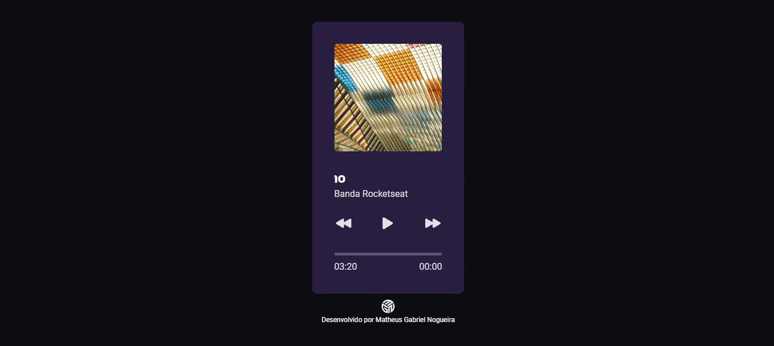

<h1 align="center">Player de Música | MGN </h1>

  <a href="#-tecnologias">Tecnologias</a>&nbsp;&nbsp;&nbsp;|&nbsp;&nbsp;&nbsp;
  <a href="#-projeto">Projeto</a>&nbsp;&nbsp;&nbsp;|&nbsp;&nbsp;&nbsp;
  <a href="#-redes">Redes</a>

---

  

---

## 🚀 Tecnologias

Esse projeto foi desenvolvido com as seguintes tecnologias:

- HTML
- CSS
- JavaScript

## 💻 Projeto

O projeto é um desafio do #boracodar da [Rocketseat](https://www.rocketseat.com.br/) que é um tipo de desafio a cada semana. Uma idéia incrível por parte da Rocketseat para estimular e desenvolver o hábito da prática.
Tem um [vídeo](https://www.youtube.com/watch?v=M_eaBcany6Y&ab_channel=Rocketseat) do no YouTube que o Mayk Brito faz a sua solução para este desafio.

---

## 🔗 Redes

Estas são minhas redes sociais. Sinta-se a vontade para mandar uma mensagem.

- [Linkedin](https://www.linkedin.com/in/eomgn/)
- [Instagram](https://www.instagram.com/matheuzngr/)
- [Twitter](https://twitter.com/eomgn)
